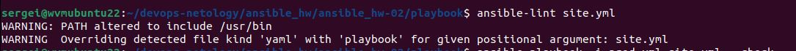
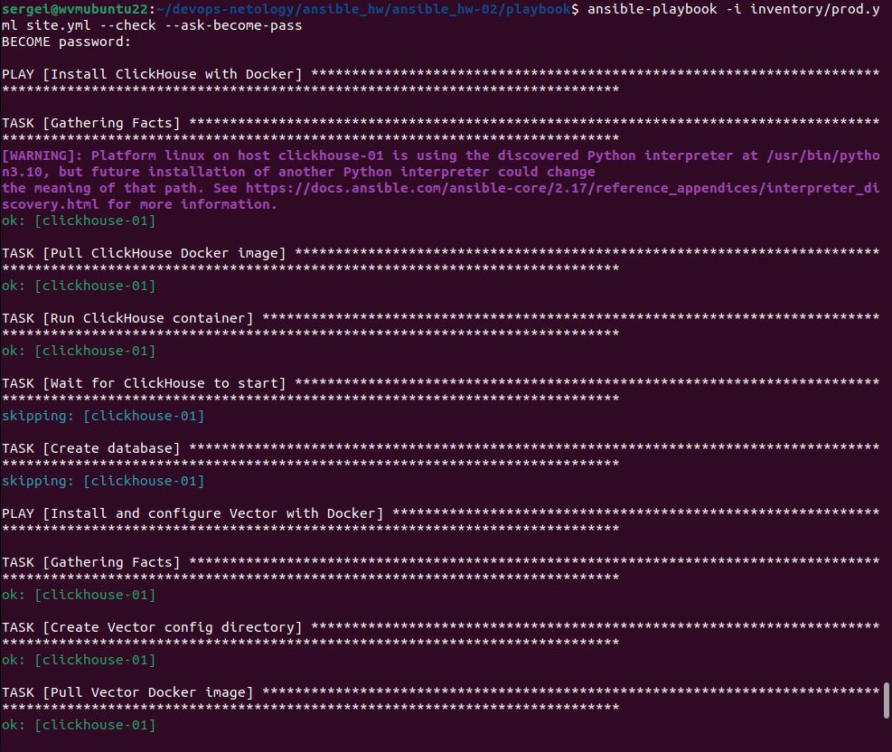
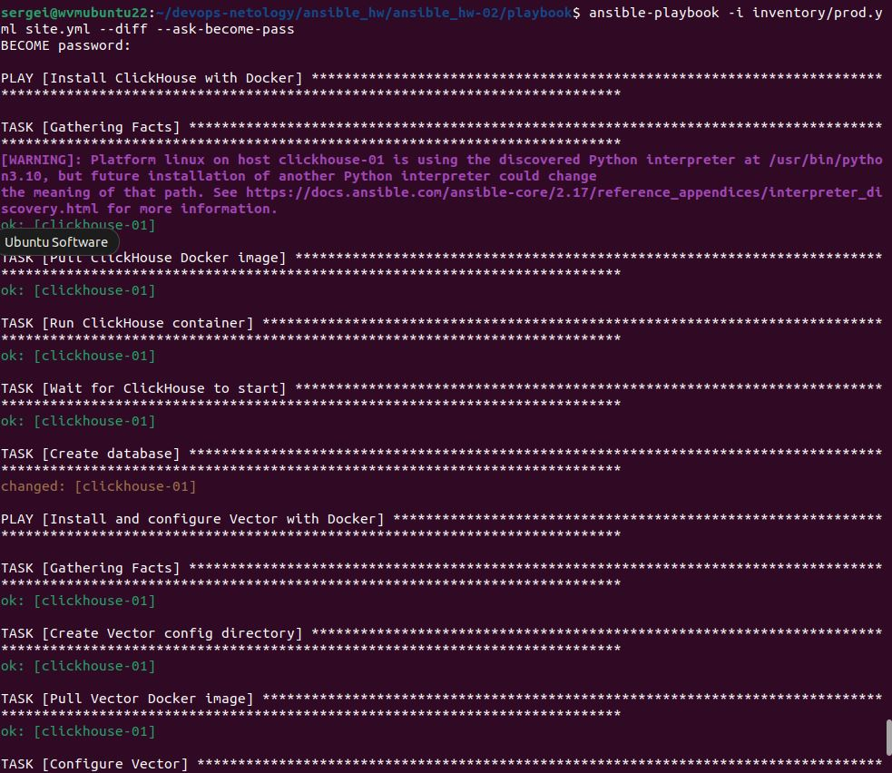
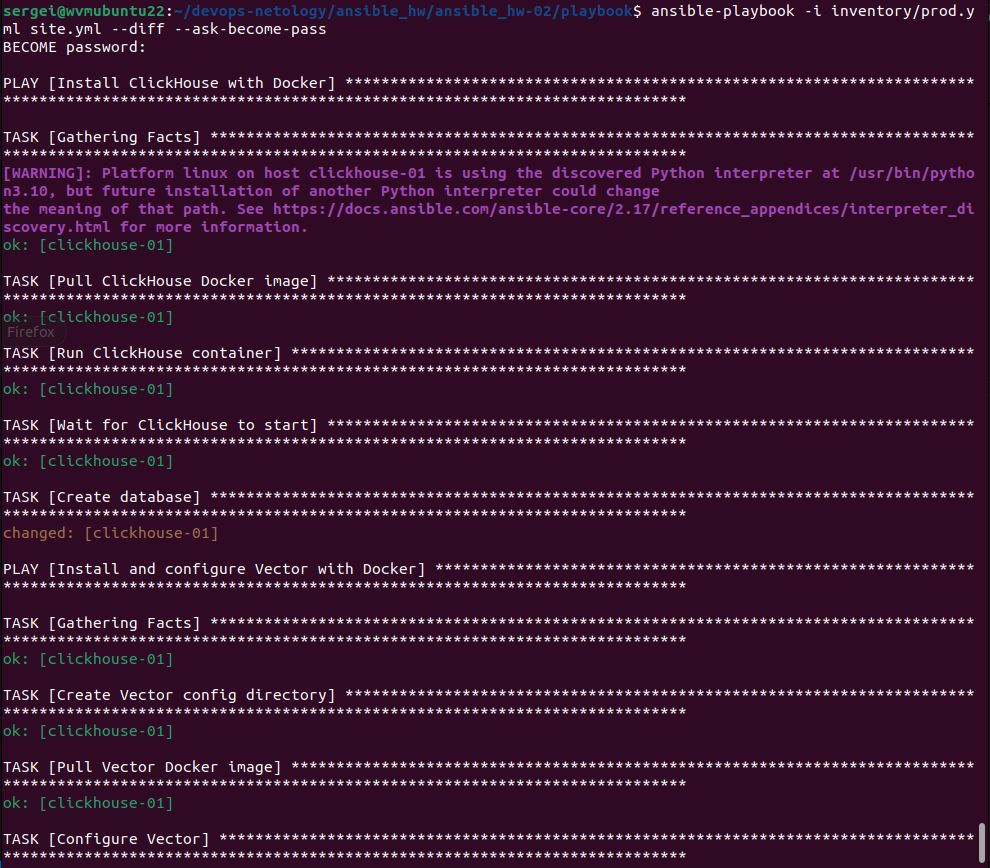

# Домашнее задание к занятию 2 «Работа с Playbook» - Пронин Сергей Николаевич

## Основная часть

1. Подготовьте свой inventory-файл `prod.yml`.
2. Допишите playbook: нужно сделать ещё один play, который устанавливает и настраивает [vector](https://vector.dev). Конфигурация vector должна деплоиться через template файл jinja2. От вас не требуется использовать все возможности шаблонизатора, просто вставьте стандартный конфиг в template файл. Информация по шаблонам по [ссылке](https://www.dmosk.ru/instruktions.php?object=ansible-nginx-install). не забудьте сделать handler на перезапуск vector в случае изменения конфигурации!
3. При создании tasks рекомендую использовать модули: `get_url`, `template`, `unarchive`, `file`.
4. Tasks должны: скачать дистрибутив нужной версии, выполнить распаковку в выбранную директорию, установить vector.
5. Запустите `ansible-lint site.yml` и исправьте ошибки, если они есть.
6. Попробуйте запустить playbook на этом окружении с флагом `--check`.
7. Запустите playbook на `prod.yml` окружении с флагом `--diff`. Убедитесь, что изменения на системе произведены.
8. Повторно запустите playbook с флагом `--diff` и убедитесь, что playbook идемпотентен.
9. Подготовьте README.md-файл по своему playbook. В нём должно быть описано: что делает playbook, какие у него есть параметры и теги. Пример качественной документации ansible playbook по [ссылке](https://github.com/opensearch-project/ansible-playbook). Так же приложите скриншоты выполнения заданий №5-8
10. Готовый playbook выложите в свой репозиторий, поставьте тег `08-ansible-02-playbook` на фиксирующий коммит, в ответ предоставьте ссылку на него.

## Решение:

```markdown
# ClickHouse and Vector Installation Playbook

This playbook installs and configures ClickHouse database and Vector log collector on Ubuntu servers.

## Features

- Installs ClickHouse from official repositories
- Creates a default database `logs`
- Installs Vector from binary distribution
- Configures Vector with basic stdin->stdout pipeline
- Sets up Vector as a systemd service

## Variables

Main variables are defined in `vars.yml`:

- `clickhouse_version`: Version of ClickHouse to install
- `clickhouse_packages`: List of ClickHouse packages to install

Vector variables are defined in the playbook:

- `vector_version`: Version of Vector to install
- `vector_config_dir`: Directory for Vector configuration

## Tags

Available tags for partial execution:

- `clickhouse`: Only install ClickHouse
- `vector`: Only install Vector

## Usage

1. Edit `prod.yml` with your server details
2. Run the playbook:
   ```bash
   ansible-playbook -i prod.yml site.yml
```







