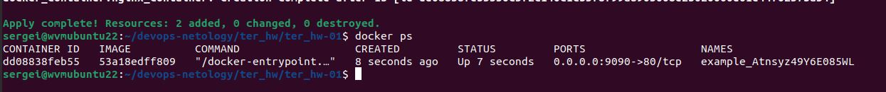
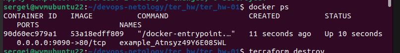
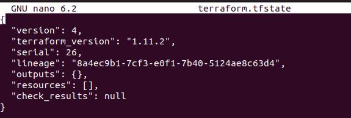

# Домашнее задание к занятию «Введение в Terraform»

### Задание 1

1. Перейдите в каталог [**src**](https://github.com/netology-code/ter-homeworks/tree/main/01/src). Скачайте все необходимые зависимости, использованные в проекте. 
2. Изучите файл **.gitignore**. В каком terraform-файле, согласно этому .gitignore, допустимо сохранить личную, секретную информацию?(логины,пароли,ключи,токены итд)
3. Выполните код проекта. Найдите  в state-файле секретное содержимое созданного ресурса **random_password**, пришлите в качестве ответа конкретный ключ и его значение.
4. Раскомментируйте блок кода, примерно расположенный на строчках 29–42 файла **main.tf**.
Выполните команду ```terraform validate```. Объясните, в чём заключаются намеренно допущенные ошибки. Исправьте их.
5. Выполните код. В качестве ответа приложите: исправленный фрагмент кода и вывод команды ```docker ps```.
6. Замените имя docker-контейнера в блоке кода на ```hello_world```. Не перепутайте имя контейнера и имя образа. Мы всё ещё продолжаем использовать name = "nginx:latest". Выполните команду ```terraform apply -auto-approve```.
Объясните своими словами, в чём может быть опасность применения ключа  ```-auto-approve```. Догадайтесь или нагуглите зачем может пригодиться данный ключ? В качестве ответа дополнительно приложите вывод команды ```docker ps```.
7. Уничтожьте созданные ресурсы с помощью **terraform**. Убедитесь, что все ресурсы удалены. Приложите содержимое файла **terraform.tfstate**. 
8. Объясните, почему при этом не был удалён docker-образ **nginx:latest**. Ответ **ОБЯЗАТЕЛЬНО НАЙДИТЕ В ПРЕДОСТАВЛЕННОМ КОДЕ**, а затем **ОБЯЗАТЕЛЬНО ПОДКРЕПИТЕ** строчкой из документации [**terraform провайдера docker**](https://docs.comcloud.xyz/providers/kreuzwerker/docker/latest/docs).  (ищите в классификаторе resource docker_image )

### Решение 1

2. Согласно .gitignore файлу, личную и секретную информацию (логины, пароли, ключи, токены и т.д.) можно сохранить в файле с именем personal.auto.tfvars. Этот файл явно указан в .gitignore, что означает, что он не будет отслеживаться Git и не попадет в репозиторий.
3. "result": "Atnsyz49Y6E085WL"
4. Ошибка 1: Missing name for resource

Error: Missing name for resource
│ 
│   on main.tf line 24, in resource "docker_image":
│   24: resource "docker_image" {
│ 
│ All resource blocks must have 2 labels (type, name).

Проблема:

В Terraform каждый ресурс (resource) должен иметь два идентификатора (labels):
Тип ресурса (например, docker_image).
Имя ресурса (уникальное имя, которое мы задаем для этого ресурса).
В нашем коде указан только тип ресурса (docker_image), но отсутствует имя ресурса.

Ошибка 2: Invalid resource name

Error: Invalid resource name
│ 
│   on main.tf line 29, in resource "docker_container" "1nginx":
│   29: resource "docker_container" "1nginx" {
│ 
│ A name must start with a letter or underscore and may contain only letters, digits, underscores, and
│ dashes.

Проблема:
Имя ресурса (1nginx) начинается с цифры (1), что нарушает правила именования в Terraform. Имена ресурсов должны:
Начинаться с буквы или символа подчеркивания.
Содержать только буквы, цифры, подчеркивания и дефисы.

Ошибка 3:
Ресурс random_password.random_string_FAKE не существует в нашем коде.
Опечатка в атрибуте resulT (должно быть result).

Исправление:

```
resource "docker_image" "nginx_image"{
  name         = "nginx:latest"
  keep_locally = true
}

resource "docker_container" "nginx_container" {
  image = docker_image.nginx.image_id
  name  = "example_${random_password.random_string.result}"

  ports {
    internal = 80
    external = 9090
  }
}
```
5.   

6. Опасности ключа -auto-approve:

Риск случайного удаления или изменения ресурсов:

Если в нашем коде есть ошибка (например, случайно удалили ресурс), Terraform применит изменения без предупреждения. Это может привести к потере данных или простою сервисов.

Например, если мы случайно удалили базу данных или виртуальную машину, восстановление может быть сложным или невозможным.

Отсутствие контроля:

Ключ отключает интерактивное подтверждение, что лишает нас возможности проверить план изменений перед их применением. Это особенно опасно в production-средах, где ошибки могут иметь серьезные последствия.

Потенциальные уязвимости в автоматизации:

Если -auto-approve используется в CI/CD-пайплайне, злоумышленник или ошибка в коде могут привести к нежелательным изменениям инфраструктуры.

Например, если кто-то отправит вредоносный Pull Request с изменениями, которые удаляют критически важные ресурсы, они будут применены автоматически.

Сложность отладки:

Если что-то пойдет не так, мы можем не сразу заметить проблему, так как изменения применяются без нашего вмешательства.

Ключ -auto-approve стоит использовать только в следующих случаях:

В development- или staging-средах, где последствия ошибок менее критичны.

В автоматизированных процессах, где ручное подтверждение невозможно (например, CI/CD).

Для небольших и безопасных изменений, которые мы полностью контролируем.

 

7.  

8. Потому что в коде отсутствует ключ  ```force remove``` со значением true.

https://docs.comcloud.xyz/providers/kreuzwerker/docker/latest/docs/resources/image#optional